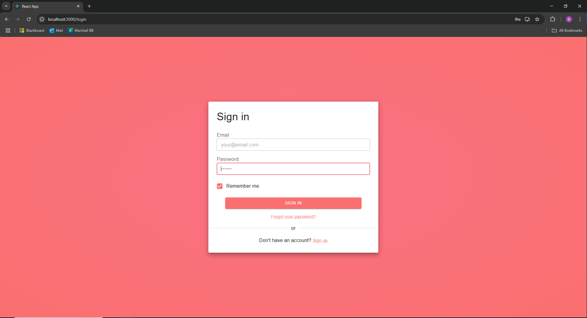
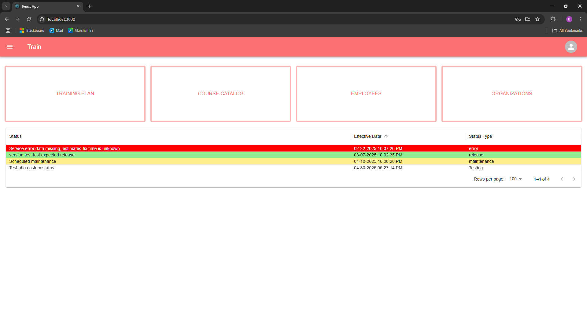
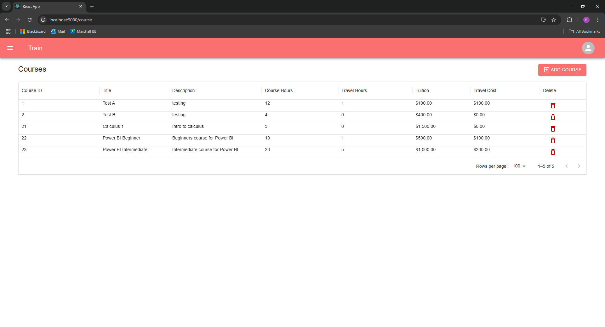
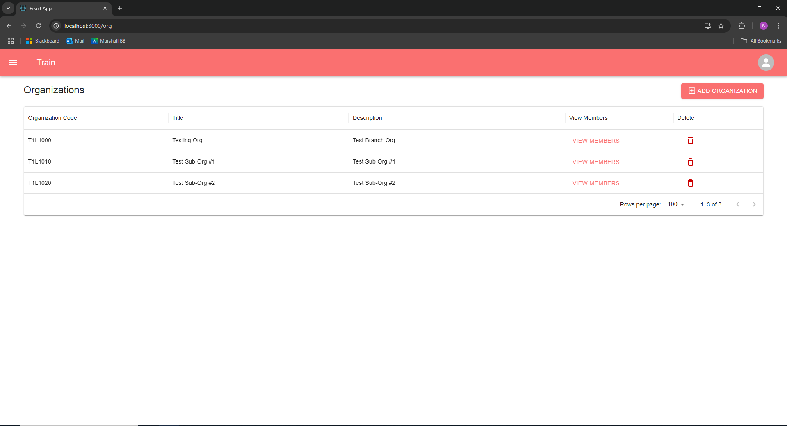
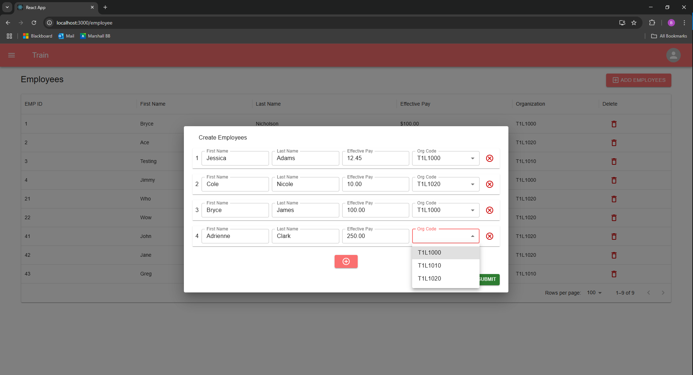
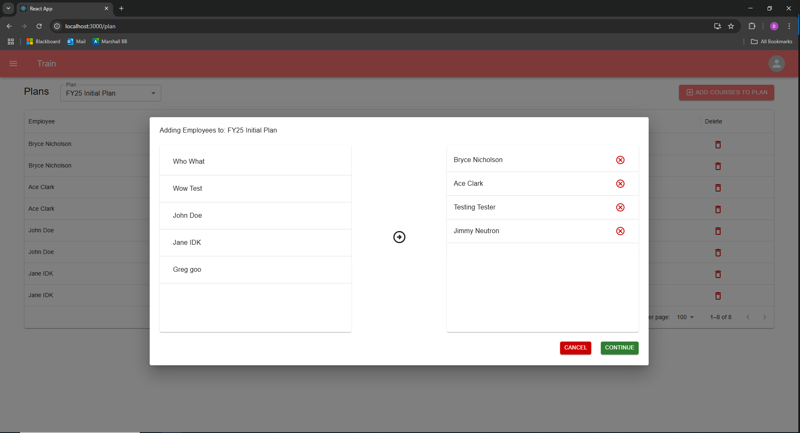
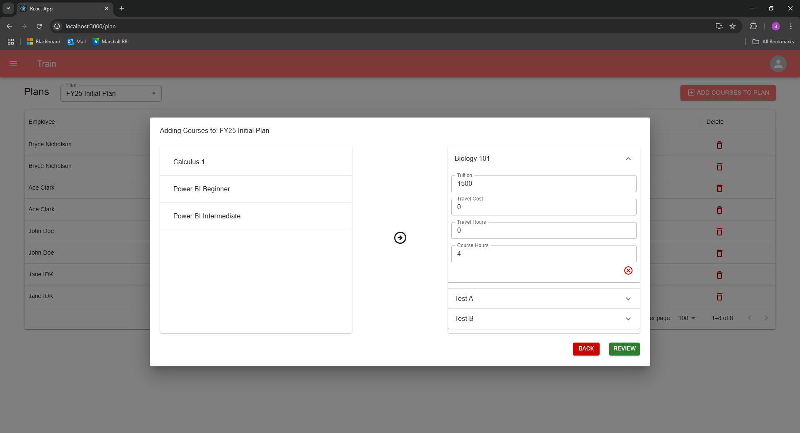
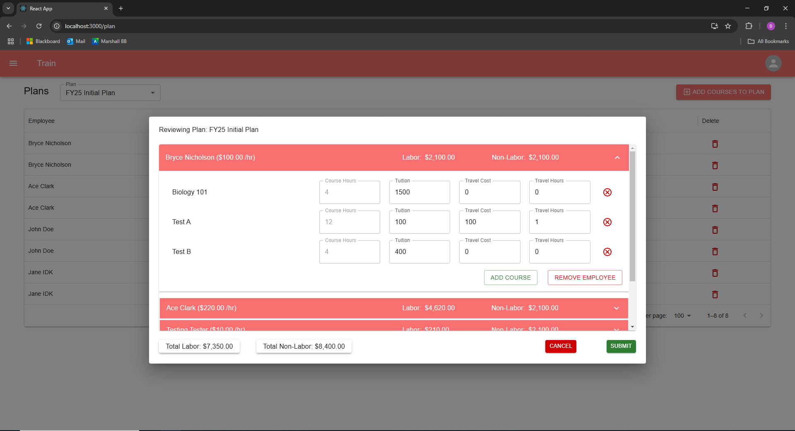
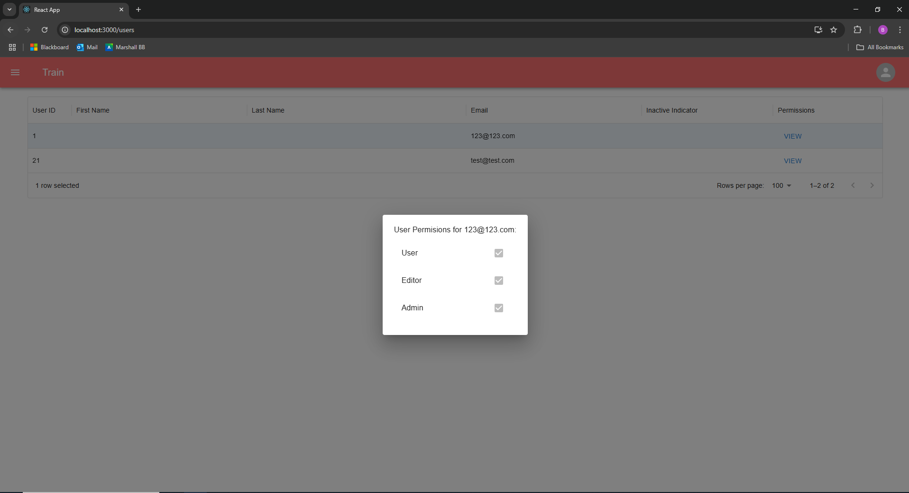

<!-- Improved compatibility of back to top link: See: https://github.com/othneildrew/Best-README-Template/pull/73 -->
<a id="readme-top"></a>
<!--
*** Thanks for checking out the Best-README-Template. If you have a suggestion
*** that would make this better, please fork the repo and create a pull request
*** or simply open an issue with the tag "enhancement".
*** Don't forget to give the project a star!
*** Thanks again! Now go create something AMAZING! :D
-->


<!-- PROJECT SHIELDS -->
<!--
*** I'm using markdown "reference style" links for readability.
*** Reference links are enclosed in brackets [ ] instead of parentheses ( ).
*** See the bottom of this document for the declaration of the reference variables
*** for contributors-url, forks-url, etc. This is an optional, concise syntax you may use.
*** https://www.markdownguide.org/basic-syntax/#reference-style-links
-->
[![Contributors][contributors-shield]][contributors-url]
[![Forks][forks-shield]][forks-url]
[![Stargazers][stars-shield]][stars-url]
[![Issues][issues-shield]][issues-url]


<!-- PROJECT LOGO -->
<br />
<div align="center">
<!--   <a href="https://github.com/othneildrew/Best-README-Template">
    
  </a> -->

  <h3 align="center">Training Course Manager</h3>

  <p align="center">
    A way to plan and maintain employee training plans!
    <br />
    <a href="https://github.com/bhnichol/TrainingManager"><strong>Explore the docs »</strong></a>
    <br />
    <br />
    <a href="https://github.com/bhnichol/TrainingManager">View Demo</a>
    &middot;
    <a href="https://github.com/bhnichol/TrainingManager/issues/new?labels=bug&template=bug-report---.md">Report Bug</a>
    &middot;
    <a href="https://github.com/bhnichol/TrainingManager/issues/new?labels=enhancement&template=feature-request---.md">Request Feature</a>
  </p>
</div>


<!-- TABLE OF CONTENTS -->
<details>
  <summary>Table of Contents</summary>
  <ol>
    <li>
      <a href="#about-the-project">About The Project</a>
      <ul>
        <li><a href="#built-with">Built With</a></li>
      </ul>
    </li>
    <li>
      <a href="#getting-started">Getting Started</a>
      <ul>
        <li><a href="#prerequisites">Prerequisites</a></li>
        <li><a href="#installation">Installation</a></li>
      </ul>
    </li>
    <li><a href="#usage">Usage</a></li>
    <li><a href="#roadmap">Roadmap</a></li>
    <li><a href="#contributing">Contributing</a></li>
    <li><a href="#license">License</a></li>
    <li><a href="#contact">Contact</a></li>
    <li><a href="#acknowledgments">Acknowledgments</a></li>
  </ol>
</details>


<!-- ABOUT THE PROJECT -->
## About The Project


This web application was initially requested to be built by my employer (USACE), however due to restricted resources I was unable to create the app using the tools I thought best. I ended up creating this app using PowerApps and preceded to create this in my own time.

This app is designed to help managers plan and maintain a training plan for their employees. Some of the features include:

* Functional authentication, with a registration and login screen. Passwords are salted, hashed, and stored properly
* The ability to create courses with customizable course hours, travel hours, travel cost, and tuition
* Creation of employees with hourly rates and assignment to organizations
* Creation of organizations
* The ability to add courses in bulk to employees and then individualize each employees courses to be added


<p align="right">(<a href="#readme-top">back to top</a>)</p>


### Built With

* [![React][React.js]][React-url]
* [![Express][expressjs.com]][express-url]
* [![Axios][axios-http.com]][axios-url]
* [![Node][Node.js]][node-url]

<p align="right">(<a href="#readme-top">back to top</a>)</p>


<!-- GETTING STARTED -->
## Getting Started

This is an example of how you may give instructions on setting up your project locally.
To get a local copy up and running follow these simple example steps.

### Prerequisites

Install the latest version of npm
* npm
  ```sh
  npm install npm@latest -g
  ```

### Installation

1. Clone the repo
   ```sh
   git clone https://github.com/bhnichol/TrainingManager.git
   ```
2. Install NPM packages (Must repeat this for both ./training_manager and ./back-end folders
   ```sh
   npm install
   ```
3. Create oracle db or use existing with user named "trainingapp" and using this [exported database script](./helper-scripts/exported_database.sql) to intialize database schema

4. Set these values in ./back-end/.env (and create this file if needed)
   ```js
   DB_USER = trainingapp \\ must use this name (although can be changed in the api and overall probably can me removed altogether)
   DB_PWD = your password
   CONNECT_STRING =  your connection string (ie localhost/XEPDB1)
   PORT = your port
   ACCESS_TOKEN_SECRET = your access token
   REFRESH_TOKEN_SECRET =  your refresh token
   ROLE_USER = 1
   ```
5. Change git remote url to avoid accidental pushes to base project
   ```sh
   git remote set-url origin github_username/repo_name
   git remote -v # confirm the changes
   ```
   
<p align="right">(<a href="#readme-top">back to top</a>)</p>


<!-- USAGE EXAMPLES -->
## Usage

Here are some screenshots of the application in use:
The login page.


The home screen which includes a status board.


The course catalog.


The organization table screen.


The Employee screen with the creation of employees.


The process of adding courses to the training plan




The admin screen.


<p align="right">(<a href="#readme-top">back to top</a>)</p>


<!-- ROADMAP -->
## Roadmap
- [ ] Refactor styling to be separate and not inline (Important!)
- [ ] Add search bars when adding courses to training plan (Search for in long list of employees/courses)
- [ ] More robust roles system
  - [ ] Configuration to edit roles within the app
  - [ ] Ability to create custom roles
- [ ] Develop profile and my account screens
  - [ ] Choose profile picture
  - [ ] Dark mode option (possible customization of entire theme)
- [ ] Status screen for admins
  - [ ] Create statuses
  - [ ] Disable statuses
  - [ ] choose custom colors for statuses   
- [ ] Add info to about/contact screen
- [ ] Create a logo


See the [open issues](https://github.com/bhnichol/TrainingManager/issues) for a full list of proposed features (and known issues).

<p align="right">(<a href="#readme-top">back to top</a>)</p>


<!-- CONTRIBUTING -->
## Contributing

If you have a suggestion that would make this better, please fork the repo and create a pull request. You can also simply open an issue with the tag "enhancement".
Don't forget to give the project a star! Thanks again!

1. Fork the Project
2. Create your Feature Branch (`git checkout -b feature/AmazingFeature`)
3. Commit your Changes (`git commit -m 'Add some AmazingFeature'`)
4. Push to the Branch (`git push origin feature/AmazingFeature`)
5. Open a Pull Request

### Top contributors:

<a href="https://github.com/bhnichol/TrainingManager/graphs/contributors">
  
</a>

<p align="right">(<a href="#readme-top">back to top</a>)</p>

<!-- CONTACT -->
## Contact

Bryce Nicholson - bhnichol22@gmail.com 

Project Link: [https://github.com/bhnichol/TrainingManager](https://github.com/bhnichol/TrainingManager)

<p align="right">(<a href="#readme-top">back to top</a>)</p>


<!-- ACKNOWLEDGMENTS -->
## Acknowledgments

* [Img Shields](https://shields.io)
* [GitHub Pages](https://pages.github.com)
* [React Icons](https://react-icons.github.io/react-icons/search)
* [Best README Template](https://github.com/othneildrew/Best-README-Template)

<p align="right">(<a href="#readme-top">back to top</a>)</p>


<!-- MARKDOWN LINKS & IMAGES -->
<!-- https://www.markdownguide.org/basic-syntax/#reference-style-links -->
[contributors-shield]: https://img.shields.io/github/contributors/bhnichol/TrainingManager.svg?style=for-the-badge
[contributors-url]: https://github.com/bhnichol/TrainingManager/graphs/contributors
[forks-shield]: https://img.shields.io/github/forks/bhnichol/TrainingManager.svg?style=for-the-badge
[forks-url]: https://github.combhnichol/TrainingManager/network/members
[stars-shield]: https://img.shields.io/github/stars/bhnichol/TrainingManager.svg?style=for-the-badge
[stars-url]: https://github.com/bhnichol/TrainingManager/stargazers
[issues-shield]: https://img.shields.io/github/issues/bhnichol/TrainingManager.svg?style=for-the-badge
[issues-url]: https://github.com/bhnichol/TrainingManager/issues
[product-screenshot]: images/screenshot.png
[Next.js]: https://img.shields.io/badge/next.js-000000?style=for-the-badge&logo=nextdotjs&logoColor=white
[Next-url]: https://nextjs.org/
[React.js]: https://img.shields.io/badge/React-20232A?style=for-the-badge&logo=react&logoColor=61DAFB
[React-url]: https://reactjs.org/
[Vue.js]: https://img.shields.io/badge/Vue.js-35495E?style=for-the-badge&logo=vuedotjs&logoColor=4FC08D
[Vue-url]: https://vuejs.org/
[Angular.io]: https://img.shields.io/badge/Angular-DD0031?style=for-the-badge&logo=angular&logoColor=white
[Angular-url]: https://angular.io/
[Svelte.dev]: https://img.shields.io/badge/Svelte-4A4A55?style=for-the-badge&logo=svelte&logoColor=FF3E00
[Svelte-url]: https://svelte.dev/
[Laravel.com]: https://img.shields.io/badge/Laravel-FF2D20?style=for-the-badge&logo=laravel&logoColor=white
[Laravel-url]: https://laravel.com
[Bootstrap.com]: https://img.shields.io/badge/Bootstrap-563D7C?style=for-the-badge&logo=bootstrap&logoColor=white
[Bootstrap-url]: https://getbootstrap.com
[JQuery.com]: https://img.shields.io/badge/jQuery-0769AD?style=for-the-badge&logo=jquery&logoColor=white
[JQuery-url]: https://jquery.com 
[expressjs.com]: https://img.shields.io/badge/Express-0769AD?style=for-the-badge&logo=express&logoColor=white
[express-url]: https://expressjs.com/
[axios-http.com]: https://img.shields.io/badge/axios-0769AD?style=for-the-badge&logo=axios&logoColor=white
[axios-url]: https://axios-http.com.com/
[Node.js]: https://img.shields.io/badge/node.js-000000?style=for-the-badge&logo=nodedotjs&logoColor=white
[Node-url]: https://nodejs.org/

